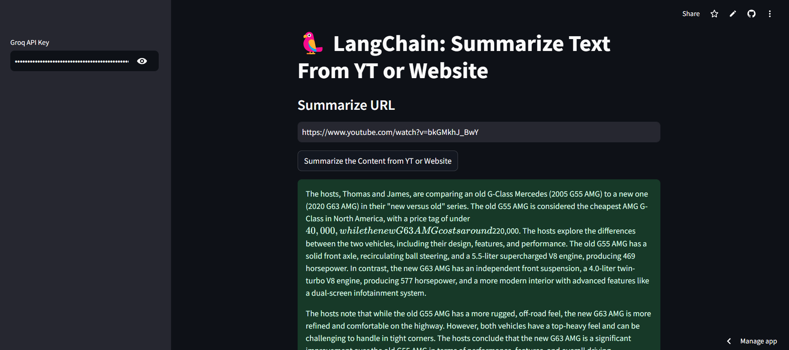

# 🥜 LangChain: Summarize Text From YT or Website

## 🌟 Introduction
Simplify content summarization with this user-friendly Streamlit app. Using LangChain and Groq's powerful LLM, this tool enables you to summarize YouTube videos or website content in just a few clicks. Say goodbye to manual note-taking and let the app do the heavy lifting! ✨

## 🚀 Key Features
- 🌐 **URL Support**: Works seamlessly with YouTube video links and general website URLs.
- 🤖 **Advanced Summarization**: Powered by Groq's Llama-3.3-70b model for accurate and concise summaries.
- 🔐 **Secure Credentials**: Your Groq API key remains private and secure.
- ⚡ **Real-time Processing**: Get instant summaries with minimal wait time.
- 🎯 **Error Handling**: Friendly prompts and error messages for smooth user experience.

## 📋 Requirements
- 🔗 langchain
- 🌐 streamlit
- 🤖 langchain-groq
- 📚validators
- 🌍 langchain-community

## 🛠️ Installation

1. ⬇️ Clone the repository:
```bash
git clone https://github.com/Yuvraj0014/Youtube-and-Website-Content-Summarization-Agent.git
cd Youtube-and-Website-Content-Summarization-Agent
```

2. 🌱 Set up a virtual environment:
```bash
python -m venv venv
source venv/bin/activate  # For Unix/MacOS
venv\Scripts\activate     # For Windows
```

3. 📦 Install dependencies:
```bash
pip install -r requirements.txt
```

4. 🚀 Launch the application:
```bash
streamlit run app.py
```

## 📱 Usage

1. 🔑 Enter your Groq API key in the sidebar.
2. 🌐 Input a valid URL (YouTube or website).
3. 🎉 Click **Summarize the Content from YT or Website** and get a concise summary in seconds.

## 🗷️ Technical Architecture

1. 🎨 **Frontend**:
   - Interactive Streamlit interface
   - Secure API key input
   - Dynamic error handling and status updates

2. ⚙️ **Backend**:
   - Groq's Llama-3.3-70b model for LLM-based summarization
   - LangChain framework for loading and processing content
   - Robust URL validation and document loaders

## 🔒 Security Features
- 🔐 API key hidden in password fields
- ❌ Validation checks for input fields to avoid errors
- ✅ Support for secure HTTPS connections

## 💡 Use Cases
- 🎥 Summarize YouTube videos for quick insights
- 🌐 Extract key information from websites
- 📚 Enhance productivity with automated note-taking
- ⚡ Get summaries for educational or professional use

## 📸 Interface Screenshot


## 📑 Learn More
For detailed documentation:
- 🔗 LangChain: [LangChain Documentation](https://python.langchain.com/)
- 🤖 Groq: [Groq Documentation](https://docs.groq.com/)
